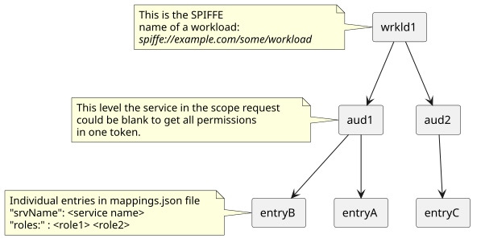

# basicAuth

*An authorization server for prototyping workloads that need simple OAuth2 tokens*

`basicAuth` is a very simple [OAuth2](https://datatracker.ietf.org/doc/html/rfc6750) authorization
server that issues [bearer JSON web tokens](https://datatracker.ietf.org/doc/html/rfc7519) to workloads. The workload is assumed to have authenticated
itself via mTLS using a SPIFFE X.509 ID (x509-SVID) using the method described in [OAuth SPIFFE Client Authentication](https://datatracker.ietf.org/doc/draft-ietf-Oauth-spiffe-client-auth/)


This was originally developed to make a very simple authorization server for an Open RAN (O-RAN) testbed. The roles in the token
can be encoded at startup. Clients requesting a token will be issued one based on 
the SPIFFE URI in the peer certificate used for mTLS authentication. The service seeks to follow the 
O-RAN specification for OAuth2 as described in [O-RAN OAuth 2.0 Security 7.0 Technical Report](https://specifications.o-ran.org/download?id=1077).

Like any [OAuth2](https://datatracker.ietf.org/doc/html/rfc6750) server, it is an HTTP
service. A client requests a new token at the `<o-ran prefix>/token`. If successful, a bearer token
is issued. No refresh token is included, so the client must request a new token when 
their previous token expires. This is in conformance with the O-RAN Technical Report recommendations.

The token includes the `roles` claim that can include one or more assigned roles for the given
SPIFFE ID. This is in line with the current RBAC methods envisioned for O-RAN, but could be used
for other RBAC uses cases.

This code is for prototype use only and **should not be used in production**. Not every security
check is implemented in order to simplify token issuing. The service produces tokens for
demostrations and for prototyping zero trust architectures.

## Features

`basicauth` can operate in different modes depending on its configuration:

* `standalone`: `basicauth` peforms its own mTLS sessions establishment. The configurtion must include the certificate, cert chain, and private key for the service. `basicauth` gets the SPIFFE ID from the client SVID used in establishing the mTLS connection.
* `mesh`: `basicauth` is part of a sidecar based service mesh (like Istio). It assumes a upstream Envoy proxy has terminiated mTLS and looks for the X-Forwarded-Client-Cert HTTP header to get the SPIFFE ID of the requesting client.
* `proxy`: Primarily used in NIST SMO configuration. It assumes there is a serivce acting as a proxy for `basicauth` (i.e. the Service Management and Orchestration service) that will include a unique HTTP header (similar to XFCC in `mesh`) that includes the necessary SPIFFE related information.


## Requirements

- Go version 1.24 or later (previous versions should work, but developed using Go 1.24).
- Authorization server is part of a service mesh.
- Envoy sidecar with a filter that passes the peer certificate along in the HTTP header
- Elliptic Curve key pair to sign JWTs. Clients that validate tokens must have the public key. Or
obtain it in a (currently unsecure) manner.  

On Linux/MacOS, OpenSSL can be used to generate the key:

`openssl ecparam -name prime256v1 -genkey -out private.pem`

To generate the private key, then:

`openssl pkey -in private.pem -pubout -out public.pem`

To extract the public portion needed by validating clients. These steps could be replaced if using
a local internal PKI.

## Usage

`basicAuth` can run as a container with a config file and file with mappings or stndalone
 The config file should be a YAML file with the following options:

* `service` : The block of parameters about the service, which has multiple sub-parameters
  * `mode` : The mode it is expected to work in. Should be one of:
    * `mesh` for service mesh, but running it its own pod or otherwise has a direct link to the sidecar proxy.
    * `test` for plain HTTP, no HTTPS, this is used with the [Bruno](https://www.usebruno.com/) test collection.
    * `standalone` For HTTPS mode, needs to have their own `httpskey`, `httpscert` and `cacert` set
  * `issuer` : The value of the `iss` field in the JWT
  * `audience` : The value of hte `aud` field in the JWT
  * `expiry` : The time (in seconds) for the validity period of tokens
  * `privkey` : The PEM string of the private key used to sign internal tokens.
  * `extkey` : The PEM string of the private key used to sign external tokens.
* `addr` : The IP address to listen on.
* `port` : The port to listen on
* `httpskey` : OPTIONAL - private key for standalone HTTPS server (not using service mesh)
* `httpscert` : OPTIONAL - certificate for standalone HTTPS server 
* `cacert` : OPTIONAL - cert chain for standalone HTTPS server
* `prefix` : Any prefix to use for the endpoints (e.g. prefix to /token)
* `mapping` : a file with mappings between SPIFFE IDs and scope. JSON format

## Mappings file

`basicauth` takes a JSON encoded file with the initial SPIFFE ID:roles mappings for tokens. This listing of role mappings
is broken down by audience and service. Token issuance can be broken down by trust zone (using `audience` in claims) and service.



The values are deployment specific, at the minium, services need to know about roles, and clients need to know about audiences/trust zones.
The client does not need to know anything, but could set the audience and/or service if known (client aware of fine grain access controls).

```json
{
    "mappings": [
        {
            "workload_id": "default",
            "privileges": [
                {
                    "audience" : "internal",
                    "services" : [
                        {
                            "srvName" : "any",
                            "roles" : "all"
                        }
                    ]
                },
                {
                    "audience": "external",
                    "services": [
                        {
                            "srvName": "prod-web",
                            "roles": "writefile"
                        }
                    ]
                }
            ] 
        },
```

### Dynamic Provisioning of New Service/Scope Pairs

To add a newly deployed service scope (so it can get tokens), the provision API is used. This is NOT an O-RAN
specificed API. The new entry for the server to store should be sent as a HTTP POST request to:

`http(s)://<addr:port>/control/provision/new`

with a JSON object with the new entry:

```json
{
    "workload_id": "spiffe://example.com/some/id",
    "privileges": [
        {
            "audience" : "internal",
            "services" : [
                {
                    "srvName" : "any",
                    "roles" : "all"
                }
            ]
        },
        {
            "audience": "external",
            "services": [
                {
                    "srvName": "any",
                    "roles": "all"
                }
            ]
        }
    ] 
}
```

### Running as a container

`basicAuth` is expecting 2 files, there are no command parameters (yet). The container with `basicauth` needs 
to mount a volume (default `/conf`) with the files.

- `basicAuth-config.yaml` with the configuration (above in **Usage**).
- `mappings.json` with initial service name->scope mapping. This file name is the default, but it could be whatever it is in the config file.

First build the container (set \<localdir\> to . if building from the repository directory)

`docker buildx build -t nist-openran/basicAuth <localdir>`

Then to run (assuming running on port 8800)

`docker run -p 8800:8800 -v <localdir>:/conf nist-openran/basicAuth`

### HTTPS Mode

`basicauth` can run with its own HTTPS service. In this configuration, the config file needs to include a
certificate and private key used for HTTPS, and the chain file for any intermediate/root certs. The cert
does not need to be from a public CA. Adding a key pair will have `basicauth` assume mTLS in operation and 
will request client certs for every connection. 

## Sending Queries to basicauth

As specified in RFC 6752, a client requesting a token sends a HTTP POST to the API endpoint. 
For basicauth is (using default config):

`http(s)://name:port/<prefix, if any>/token`

Where the body has the `application/x-www-form-urlencoded` media type. The "form" has the following
entries:

* grant_type: **MUST** be `client_credentials`
* client_id: the ID of the client, used to look up which scope to encode in the token.
* client_secret: A secret string to authenticate the client **NOT USED**
* scope: the requested scope broken down to "trust boundary::service" e.g., `internal::prod-web`. "trust boundary" MUST NOT be blank. If service portion is left blank, `basicauth` includes all roles for all services. 

## Bruno Test Collection

The `basicauth-test-bruno` folder contains a [Bruno](https://www.usebruno.com/) collection with API test calls. This is to help
developers who extend `basicauth`. Depending on the values used in the config file, some of the test calls may need to be editted. 
This collection is not needed to operate `basicauth` but instead provided to aid in testing the `basicauth` API if desired.

**DISCLAIMER**: Certain equipment, instruments, software, or materials are identified in this file in order to specify the experimental
 procedure adequately.  Such identification is not intended to imply recommendation or endorsement of any product or service by NIST, 
 nor is it intended to imply that the materials or equipment identified are necessarily the best available for the purpose.

## Acknowledgements

The files in this repository is based on work that was funded by the Department of Homeland Security (DHS) Science & Technology Directorate.

## Contact Information and Disclaimer

Questions/comments can be sent to [scott.rose@nist.gov](mailto:scott.rose@nist.gov). More information about the project can
be found on the [Advanced Security Architectures for Next Generation Wireless](https://www.nist.gov/programs-projects/advanced-security-architectures-next-generation-wireless) project page.

NIST-developed software is provided by NIST as a public service. You may use, copy and distribute copies of the software in any medium, provided that you keep intact this entire notice. You may improve, modify and create derivative works of the software or any portion of the software, and you may copy and distribute such modifications or works. Modified works should carry a notice stating that you changed the software and should note the date and nature of any such change. Please explicitly acknowledge the National Institute of Standards and Technology as the source of the software.

NIST-developed software is expressly provided "AS IS." NIST MAKES NO WARRANTY OF ANY KIND, EXPRESS, IMPLIED, IN FACT OR ARISING BY OPERATION OF LAW, INCLUDING, WITHOUT LIMITATION, THE IMPLIED WARRANTY OF MERCHANTABILITY, FITNESS FOR A PARTICULAR PURPOSE, NON-INFRINGEMENT AND DATA ACCURACY. NIST NEITHER REPRESENTS NOR WARRANTS THAT THE OPERATION OF THE SOFTWARE WILL BE UNINTERRUPTED OR ERROR-FREE, OR THAT ANY DEFECTS WILL BE CORRECTED. NIST DOES NOT WARRANT OR MAKE ANY REPRESENTATIONS REGARDING THE USE OF THE SOFTWARE OR THE RESULTS THEREOF, INCLUDING BUT NOT LIMITED TO THE CORRECTNESS, ACCURACY, RELIABILITY, OR USEFULNESS OF THE SOFTWARE.

You are solely responsible for determining the appropriateness of using and distributing the software and you assume all risks associated with its use, including but not limited to the risks and costs of program errors, compliance with applicable laws, damage to or loss of data, programs or equipment, and the unavailability or interruption of operation. This software is not intended to be used in any situation where a failure could cause risk of injury or damage to property. The software developed by NIST employees is not subject to copyright protection within the United States.
